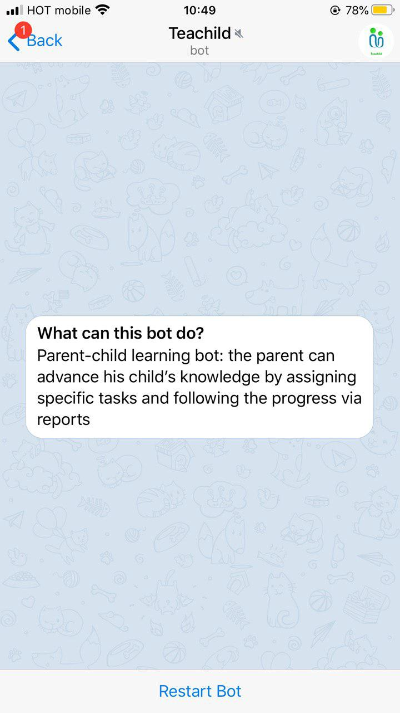
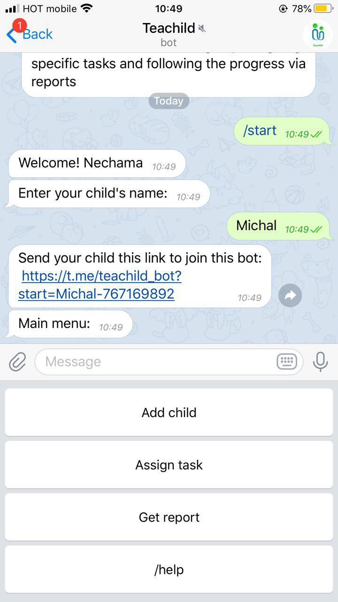
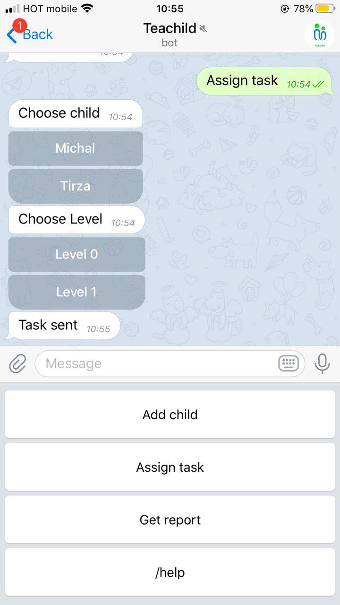
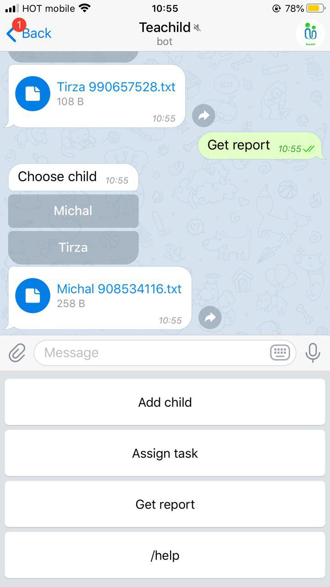
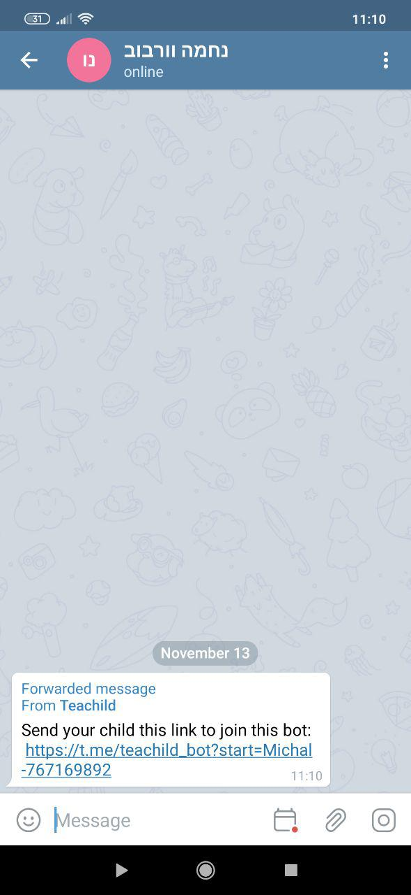
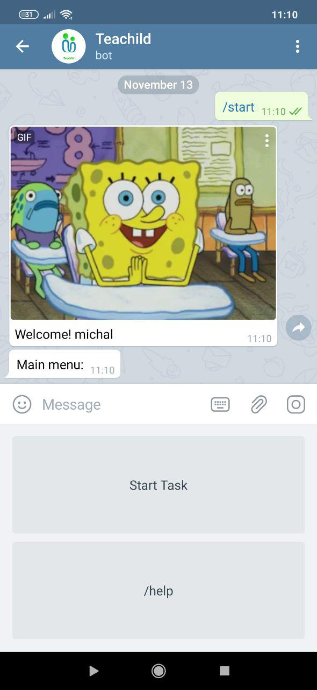
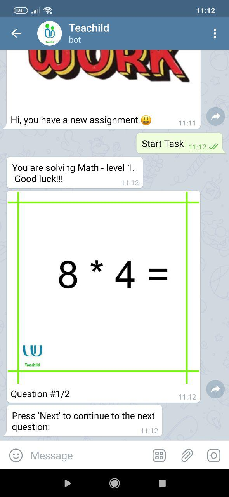
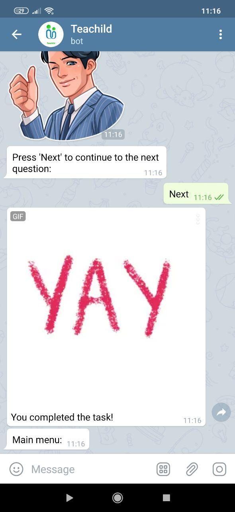

# Teachild
<https://t.me/teachild_bot>

Parent-child learning bot: The parent can advance his child's knowledge by assigning specific tasks and following the progress via reports.

* Nechama Verbov
* Chedva Edry
* Michal Ratner
* Tirza Rubinstain

#### Screenshots

## How to Run This Bot
### Prerequisites
* Python 3.7
* pipenv
* mongoDB

### Setup
* Clone this repo from github: https://github.com/Elevationacademy/xt-bareket-bot-hackathon-michal-tirza-chedva-nechama.git
* Install dependencies: `pipenv install`, `install telegram`
* Get a BOT ID from the [botfather]: <https://t.me/teachild_bot>

### Run
To run the bot use:

    pipenv run python bot.py

### Running tests
First make sure to install all dev dependencies:

    pipenv install --dev

To run all test  use:

    pipenv run pytest

## Credits and References
* [Telegram Docs](https://core.telegram.org/bots)
* [python-telegram-bot](https://github.com/python-telegram-bot/python-telegram-bot)
* [mongoDB Documentation] (https://www.mongodb.com/)
* [w3resource](https://www.w3resource.com/)
* [metro](https://forums.meteor.com/)
* [Google]

* Avigail wilk - help with DB
* Elana Flesanthal - help with parsing
* Tamar Apelbaum - help with gif's
